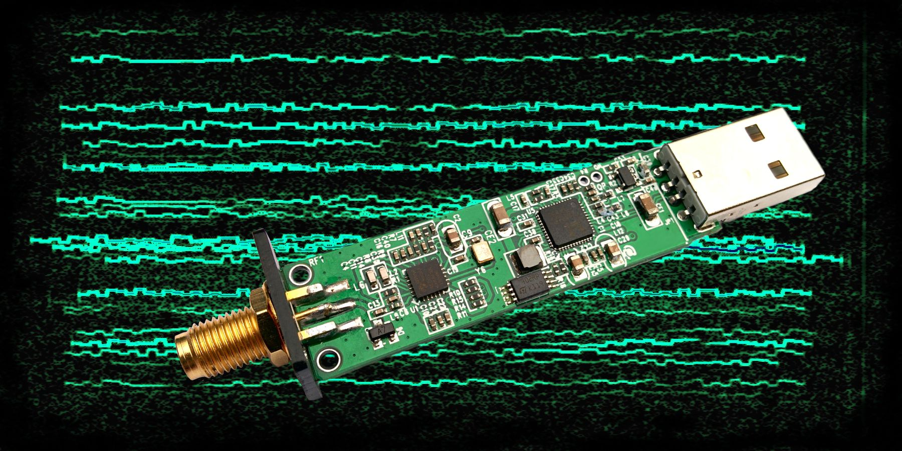

# rtlsdr-wsprd -- WSPR daemon for RTL receivers

[](art/)

[](https://github.com/Guenael/rtlsdr-wsprd/actions/CI)


## TL;DR

This project aim at decoding FT8 signals using an RTL device, usually connected to a Raspeberry Pi.
To install and use your dongle on a Rasberry Pi with a Rasberian OS:

```
sudo apt-get -y install build-essential cmake libfftw3-dev libusb-1.0-0-dev librtlsdr-dev libcurl4-gnutls-dev
git clone https://github.com/Guenael/rtlsdr-wsprd
cd rtlsdr-wsprd
make
make install
rtlsdr_wsprd -f 2m -c A1XYZ -l AB12cd -g 29
```

## Overview

This non-interactive application allows automatic reporting of WSPR spots on WSPRnet. The inital idea was to allow a small computer like a Raspberry Pi and a RTL-SDR device to sent WSPR reports for VHF/UHF bands. This kind of lightweight setup could run continuously without maintenance and help to get additionnal propagation reports. The code is massively based on Steven Franke (K9AN) implementation of Joe Taylor (K1JT) publication and work.

This application written in C does:

- A time alignment (2 mins, required NTPd to run on the OS)
- Start the reception using the RTL lib
- Decimate the IQ data (2.4Msps to 375 sps)
- Decode WSPR signal
- Push the spots on WSPRnet
- Repeat, again and again...


## Installation

  1. Install a Linux compatible distro on your device (ex. Raspbian for RaspberryPi)
  1. Install dependencies & useful tools (for example, NTP for time synchronization). Example with a Debian based like Raspbian:
     ```
     sudo apt-get -y install build-essential cmake libfftw3-dev libusb-1.0-0-dev librtlsdr-dev libcurl4-gnutls-dev
     ```
  1. Clone this repository:
     ```
     git clone https://github.com/Guenael/rtlsdr-wsprd
     ```
  1. Build the application:
     ```
     cd rtlsdr-wsprd
     make
     make install
     ```
  1. Start the application with your right paramaters, ex. for the 2m band, with a fake callsign (A1XYZ):
     ```
     rtlsdr_wsprd -f 2m -c A1XYZ -l AB12cd -g 29
     ```

## Tips (for your Raspberry Pi and SDR dongles)

  - Use ferrite bead on the USB cable to limit the QRN
  - Use an external clean power supply
  - Cut off the display (could help to reduce QRN)
    ```
    /opt/vc/bin/tvservice -o
    ```
  - Remove unused modules (for example, /etc/modules: #snd-bcm2835)
  - Use an enclose, and ground it


## Crystal stability

Most of RTL dongles use a cheap crystal, and frequency drift can effect the decoding & performance. The use of no-name RTL dongle for VHF/UHF bands usually require crystal modification, for a better one. External clock could be also used, like GPSDO or rubidium reference clock, aligned on 28.8MHz.

Some manufacturers intergrate a 0.5ppm TCXO. It's the best second option, after an external clock. Based on my personnal experience:

- NooElec NESDR SMART : Works fine out of the box
- RTL-SDR Blog 1PPM TCXO : Works with some drift, require additional mass, or a better enclosure
- Other no-name like : RT820, E4000, FC0012, FC0013, can work, but require modification and drift a lot

Ex: NooElec NESDR SMArt - Premium RTL-SDR w/ Aluminum Enclosure, 0.5PPM TCXO
https://www.nooelec.com/store/nesdr-smart.html
